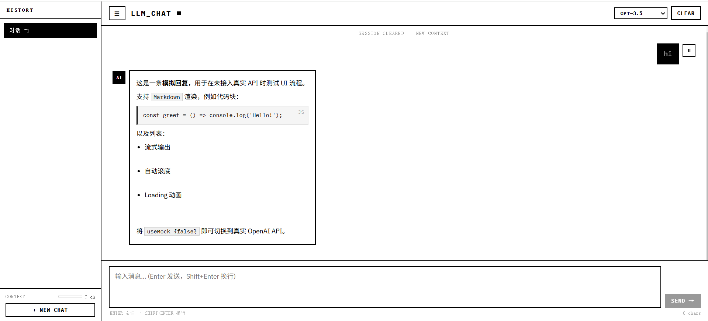

# LLM Chat App

A modern AI-powered conversational web application built with React and Vite.

This project simulates a real-world LLM chat interface with support for markdown rendering, code blocks, dynamic message flow, and mock/API response modes.

---

## 中文说明

这是一个基于 React + Vite 构建的 AI 对话 Web 应用，用于学习前端工程化、LLM UI 设计与 API 集成。

---

# Preview

## Main Chat Interface



---

# Features

- Real-time chat interface
- Mock response mode for UI testing
- OpenAI / OpenRouter API integration
- Markdown message rendering
- Syntax-highlighted code blocks
- Streaming-style interaction flow
- Auto-scrolling chat window
- Responsive component-based architecture

---

# Tech Stack

- React
- Vite
- JavaScript
- React Markdown
- OpenAI API / OpenRouter API
- CSS

---

# Project Structure

```txt
src/
 ├── components/
 │    ├── Chat.jsx
 │    ├── ChatInput.jsx
 │    ├── Message.jsx
 │    ├── Sidebar.jsx
 │    └── Header.jsx
 │
 ├── hooks/
 │    └── useChat.js
 │
 ├── services/
 │    └── openai.js
 │
 ├── App.jsx
 └── main.jsx
```

# Installation

```bash
git clone https://github.com/SiTong-Lee-Ma/llm-chat-app.git

cd llm-chat-app

npm install

npm run dev
```

---

# Environment Variables

Create a `.env` file in the project root:

```env
VITE_OPENAI_API_KEY=your_api_key
```

---

# Future Improvements

- Real-time streaming responses
- Multi-session chat history
- Dark mode
- Mobile responsive optimization
- Local storage persistence
- Multi-model switching
- Authentication support

---

# License

MIT